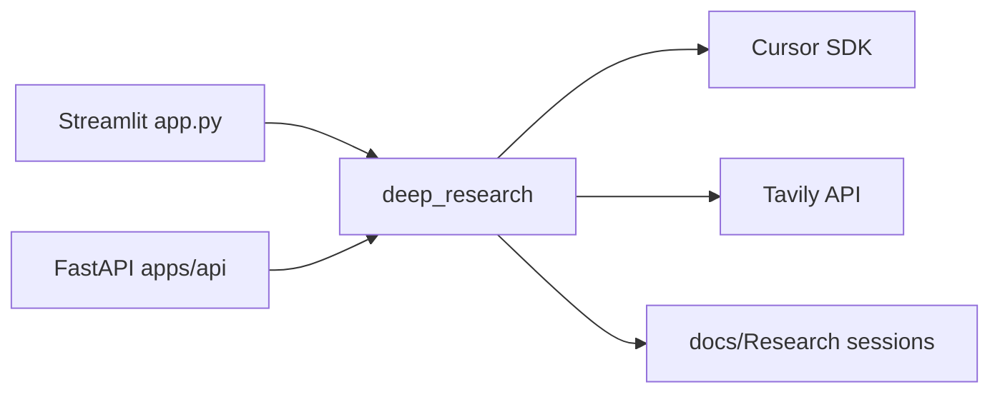

# Deep Research

Autonomous research agent built on the **Cursor SDK** and **Tavily**. Search the web, cite sources, and generate reports, mind maps, slides, and paper summaries from a single question.

[](https://share.streamlit.io)

> **Replace the badge URL** with your deployed app after following [docs/STREAMLIT_CLOUD_DEPLOY.md](docs/STREAMLIT_CLOUD_DEPLOY.md).

## Features

- **Full mission** — autonomous multi-deliverable research with session artifacts
- **Quick query** — one-shot answer without full session setup
- **Guided chat** — multi-turn conversation with memory
- **HTTP API** — automate missions, follow-ups, corpus query, and ZIP export
- **Multi-agent pipeline** — search → synthesize → artifacts → review

## Quick start (local)

**Requirements:** Python 3.10+, [Cursor API key](https://cursor.com/dashboard/integrations), [Tavily API key](https://tavily.com/) (recommended)

```powershell
git clone https://github.com/ketan01bakshi-dev/Deep-research.git
cd deep-research
python -m venv .venv
.\.venv\Scripts\pip install -r requirements.txt
copy .env.example .env
# Edit .env — add CURSOR_API_KEY and TAVILY_API_KEY
.\run_app.cmd
```

Open http://localhost:8501

### Verify setup

```powershell
.\run_tests.cmd
.\.venv\Scripts\python.exe scripts\verify_setup.py
```

## API keys

| Variable | Required | Get it |
|----------|----------|--------|
| `CURSOR_API_KEY` | Yes | [Cursor integrations](https://cursor.com/dashboard/integrations) |
| `TAVILY_API_KEY` | Recommended | [Tavily](https://tavily.com/) |
| `DEEP_RESEARCH_API_KEY` | For exposed API | Set your own secret |

## Interfaces

| Interface | Command | Port |
|-----------|---------|------|
| Streamlit UI | `run_app.cmd` | 8501 |
| HTTP API | `run_api.cmd` | 8765 |

Sessions are stored under `docs/Research/{session_id}/`.

## Public demo (Streamlit Cloud)

Host a free live demo at `https://your-app.streamlit.app`:

1. Push this repo to **public GitHub**
2. Follow [docs/STREAMLIT_CLOUD_DEPLOY.md](docs/STREAMLIT_CLOUD_DEPLOY.md)
3. Set secrets from [.streamlit/secrets.toml.example](.streamlit/secrets.toml.example)

Demo mode (`PUBLIC_DEMO=true`) enables password gate, daily mission caps, and automatic session cleanup.

## Deliverables

`answer`, `report`, `mindmap`, `slides`, `papers`, `paper_summary`

> **Note:** Mind maps require Node.js and Chromium locally. On Streamlit Cloud, mindmap deliverable may be unavailable — use `answer` or `report` for demos.

## Architecture



## Legal & disclaimer

- **AI outputs may be inaccurate** — verify before relying on them.
- `cursor-sdk` is **proprietary** (Cursor) — you need your own Cursor account and API key.
- Downloaded PDFs may be third-party copyrighted material.
- See [docs/LEGAL.md](docs/LEGAL.md) and [SECURITY.md](SECURITY.md).

## Contributing

See [CONTRIBUTING.md](CONTRIBUTING.md). Run `.\run_tests.cmd` before opening a PR.

## License

MIT — see [LICENSE](LICENSE). Third-party services (Cursor, Tavily) have their own terms.
